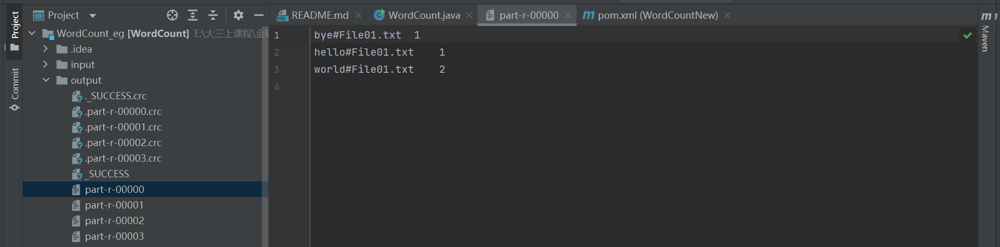

# <center>作业5 Hadoop编程</center>

<center>朱彤轩 191840376</center>

[TOC]

## 1. 配置Intellij以本地运行和调试MapReduce程序 

先安装Intellij Community版本与JDK，然后按照CSDN教程[Hadoop: Intellij结合Maven本地运行和调试MapReduce程序 (无需搭载Hadoop和HDFS环境)](https://blog.csdn.net/binbigdata/article/details/80380344)进行配置，我将详细叙述我遇到的bug与解决方案。


解决方法： 按照教程[Cygwin安装教程](https://blog.csdn.net/u010356768/article/details/90756742)安装cygwin，把cygwin的bin目录加到windows的用户环境变量中然后重启电脑。

## 2. 代码编写思路

本作业代码在Hadoop官方示例wordcount2的基础上进行改进，官方示例已经可以读取多个文件、忽略大小写与标点符号。改进如下：

### 2.1 特殊词的处理

#### 2.1.1 大小写不敏感

去掉原来代码中的判断，直接全部转为小写

#### 2.1.2 去标点符号

复制wordcount2中的`parseSkipFile`名称改为`parseSkipPunctuation`，同时原来代码中是希望将文本中的标点符号替换为空字符，这里改为替换成空格。因为英文中所有格`'s`与前后文是没有空格的。

```java
for (String pattern : punctuations) { 
    line = line.replaceAll(pattern, " ");
}
```

#### 2.1.3 去停用词

延用wordcount2中的`parseSkipFile`，读取filename路径下的文件，将文件中的需要词加入停用词列表`patternsToSkip`。

在map对句子按空白符分词之后，查看每个单词是否在停用词列表中，如果在则略过(continue)，如果不在，进行进一步处理。

```java
if(patternsToSkip.contains(one_word)){
    continue;
}
```

#### 2.1.4 忽略数字与单词长度小于3

用正则表达式判断是否是数字，计算字符串长度筛选复合条件的字符串。

```java
//判断是否长度小于3
if(one_word.length()<3) {
	continue;
}
//判断是否是数字，用正则表达式
if(Pattern.compile("^[-\\+]?[\\d]*$").matcher(one_word).matches()) {
	continue;
}
```

### 2.2 输出每个作品以及所有作品前100个高频单词

我一共用4个job串行实现作业中`输出每个作品以及所有作品前100个高频单词`的要求。在完成“输出每个作品前100高频词”时，我想设置作品个数个reducer，每个reducer负责对该文件统计词频结果进行输出。但是在一个job中是无法对value进行排序的，要想实现纯粹对value的排序，应该先输出中间文件，再读取，之后将value与key倒置，让mpr程序自动帮忙排序。所以最终放弃了设置多个reducer这个想法。

#### 2.2.1 第一个job-word count

| 原Class  | 继承Class           |
| -------- | ------------------- |
| Mapper   | TokenizerFileMapper |
| Combiner | IntSumReducer       |
| Reducer  | IntSumReducer       |

TokenizerFileMapper打开输入输入参数下文件夹，一个mapper负责一个文件。每次取一行进行分词，然后经过`2.1`节的判断，复合规范的加上获取的文件名，输出`<key: word#filename, value: 1>`。

由于只有一个reducer，具有相同filename的单词会被分配到同一个reducer中，所以没有采用InvertedIndexer中的重写combiner和partitioner。

IntSumReducer对词频进行统计，并输出`<key: word#filename, value: count>`到中间文件夹`tmp-file-word-count`中，这里的词频是单词在一个文件中出现的次数。

#### 2.2.2 第二个job-sort file

| 原Class | 继承Class       |
| ------- | --------------- |
| Mapper  | InverseMapper   |
| Reducer | SortFileReducer |

此job的输入为上一个job的输出，也即中间文件夹`tmp-file-word-count`。

InverseMapper为hadoop自带的mapper，把读取进来的key与value进行倒置。也就是原来`<key: word#filename, value: count>`，倒置之后变成`<key: count, value: word#filename>`。

重写一个IntWritableDecreasingComparator类，按照新的key（频数）进行降序排 序（原本默认是升序）传给reducer。

SortFileReducer实现的功能为输出每个文件的高频100词到名为`filename-r-0000`的文件中去，统一保存在中间文件夹`single-file-output`文件夹中。

**SortFileReducer实现思路：**

mapper输出为`<key: count, value: word#filename>`，那么传到reducer看到的就是`<count, [word1#filename1, word2#filename2...]>`。

定义一个Hashmap，key为filename，value为从高频到低频遍历过程中，名为filename的已输出的高频词数。当map[filename]为100，遍历到filename文件时，直接continue；当map的value和为40*100=4000时，break出来，结束reduce。

没遇到一个词，就按照`<rank>：<word>，<count>`的格式输出到名为`filename-r-0000`的文件中去。此处用了hadoop的`MultipleOutputs`。

代码如下：


#### 2.2.3 第三个job-all word count

| 原Class  | 继承Class           |
| -------- | ------------------- |
| Mapper   | TokenizerFileMapper |
| Combiner | IntSumReducer       |
| Reducer  | IntSumReducer       |

与第一个job类似，唯一不同的是这次mapper输出为`<key: word, value: 1>`。最终输出每个词在所有文件的词频到文件夹`tmp-all-word-count`中。

#### 2.2.4 第四个job-sort all

| 原Class | 继承Class      |
| ------- | -------------- |
| Mapper  | InverseMapper  |
| Reducer | SortAllReducer |

前面与第二个job实现一样，在reducer上更为简单，直接按格式输出前100个高频词到output文件夹中即可。新的key为符合输出格式的Text类（字符串拼接），value为 NullWritable。

## 3. 文件夹目录结构


- classes：各个类
- input：40个莎士比亚作品txt
- output：所有文件的高频100词文件
- single-file-output：每个文件的高频100词文件
- skip：标点以及停用词存放
- src：源码
- tmp-all-word-count：中间文件之每个单词在所有文件中词频
- tmp-file-word-count：中间文件之每个单词在单个文件中词频

## 4. 实验结果

#### 4.1 windows系统下运行截图


#### 4.2 Linux系统运行

代码编译：


在终端运行代码：

```shell
ztx@191840376:~/workspace/hw5/wcdemo/wordcountfinal$ hadoop jar wordcount.jar /input /output -skip /skip/stop-word-list.txt /skip/punctuation.txt
```


所有文件高频100词：


每个作品高频100词（选`shakespearealls11-r-00000`展示）


All Applications截图：


job-word count：


job-sort file：


job-all word count：


job-sort all：


## 5. 遇到问题及解决

### 5.1 无法运行wordcount2

出现了按照教程配置好Intellij之后能运行wordcount但是运行不了wordcount2，显示有一些类无法识别：


更换了配置文件，具体见文件夹中的`pom.xml`。

### 5.2 更换配置后找不到HADOOP_HOME

`java.io.FileNotFoundException: HADOOP_HOME and hadoop.home.dir are unset.`

本地远程连接Hadoop系统时需要在本地配置相关的Hadoop变量，主要包括hadoop.dll 与 winutils.exe 等。在[GitHub](https://github.com/steveloughran/winutils)上下载与配置文件中版本相符的**hadoop.dll 与 winutils.exe**，设置环境变量，把hadoop.dll文件复制到`C:\Windows\System32`下，最后重启。


### 5.3 Intellij下没有输出提示直接执行结束

如下图所示，没有输出任何提示性输出，比如执行进程，直接显示执行成功：


在`src/main/resources`目录下创建`log4j.properties`，文件内容为：


### 5.4 试图魔改Combiner

我希望在Combiner中计算出词频，然后将key与value倒置以进行词频排序，但是输出错误，错误提示：

`wrong value class: class org.apache.hadoop.io.Text is not class org.apache.hadoop.io.IntWritable`

[StackOverFlow](https://stackoverflow.com/questions/30546957/wrong-value-class-class-org-apache-hadoop-io-text-is-not-class-org-apache-hadoo)解释：

> Output types of a combiner **must** match output types of a mapper. Hadoop makes no guarantees on how many times the combiner is applied, or that it is even applied at all. And that's what happens in your case.
>
> Values from map (`<Text, IntWritable>`) go directly to the reduce where types `<Text, Text>` are expected.

所以放弃这种做法，转而采取报告中所写的。

### 5.5 采用倒排索引中的NewPartitioner但是只有一个reducer

一个reducer应该有一个对应的输出文件。参考倒排索引中的NewPartitioner，我想让所有具有相同filename的文件进入同一个reducer然后被输出。在这种逻辑下，应该有多个文件输出，但是试试并非如此。

后来发现，需要在设置partitioner之后规定reduce的task个数：

```java
job.setPartitionerClass(NewPartitioner.class);
job.setNumReduceTasks(4);
```

这样就可以做到用partition将文件分到不同reducer，并输出多个文件：



### 5.6 将代码转移至Linux执行报错

执行过程中报找不到Class的错误：


在代码中加上`job.setJar("wordcount.jar")`即可：


## 6. 任务可以改进的地方

1. 现阶段都是在一个reducer上进行，可以多用几个reducer提升效率。

2. 存在硬编码情况，多文件输出时需要定义，我获取了input目录下所有文件名循环执行了定义，不知道有没有更加高效的方法。

   

3. 程序功能可以更多样， 例如进行名词单、复数、动词时态的还原等。

4. 现阶段计算“每个文件高频前100”与“所有文件高频前100”比较割裂没有联系，可以探索是否有方法减少job，通过使得前后计算结果可以被充分利用。


